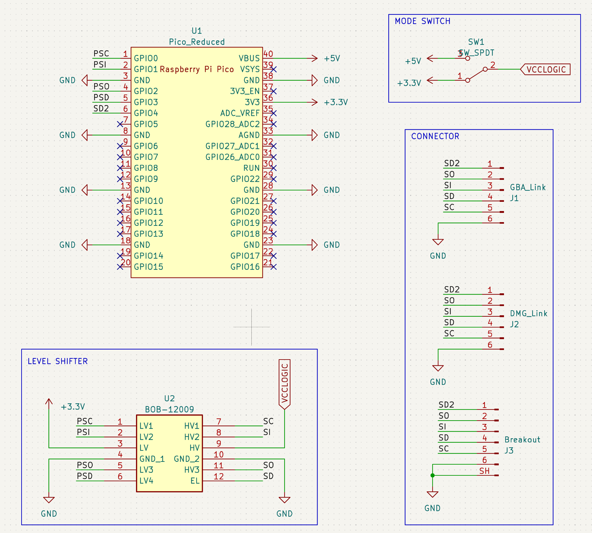

# GB-Link USB DIY: USB TO GAME BOY LINK ADAPTER

An Open-Source USB to Gameboy Link Cable Adapter for Raspberry Pi Pico. Designed with components that are easy to source and solder.

# Required Components

| Reference | Part Number | Description |
|-|-|-|
| U1 | [Raspberry Pi Pico](https://www.raspberrypi.com/products/raspberry-pi-pico/) | Clones are compatible |
| U2 | [BOB-12009](https://www.sparkfun.com/products/12009) | Sparkfun Bi-Directional Logic Level Converter, clones are compatible |
| SW1 | [SS12D00-G3](https://www.amazon.com/Tnuocke-Vertical-Position-Switches-SS12D00-G3/dp/B099MRCDG8) | 3 Pin SPDT Switch with 1" (2.54mm) Pitch |

# How to Order Board

To order a board, use the `gerbers.zip` from the release page or generate one yourself. You can order from your favourite PCB manufacturer ([JLCPCB](https://jlcpcb.com/), [PCBWay](https://www.pcbway.com/), etc.).

**Use 1.2mm PCB thickness.**

You can choose any colour for the Solder Mask and Silkscreen. For the Surface Finish, ENIG is highly recommended.

# How to Assemble Board

1. Sand the PCB edge connectors if necessary.
2. Solder pin header to Raspberry Pi Pico and Level Shifter module. Use a breadboard for easier pin soldering.
3. Solder Raspberry Pi Pico and Level Shifter module to the board
5. Solder the 1x3 Pin Header to the board, and place the Pin Jumper
6. Flash firmware to your Raspberry Pi Pico

Recomended firmware:
- [https://github.com/GB-Link/GBLink-Firmware/releases](https://github.com/GB-Link/GBLink-Firmware/releases)
List of clients for the GB-Link firmware found at [https://launcher.gblink.io/](https://launcher.gblink.io/)

Other compatible firmware:
- https://github.com/Celio-Link/Celio-Firmware
- https://github.com/Lorenzooone/pico-gb-mobile-adapter
- https://github.com/starlarkus/gb-link-firmware-reconfigurable
- https://github.com/stacksmashing/gb-link-firmware
- https://github.com/stacksmashing/gb-link-printer
- https://github.com/dj505/GBPrinterEmu
- https://github.com/Squaresweets/GBPrinter-discord-bot
- https://github.com/KuestenKeks/pc-to-gb-printer

- Raspberry Pi Pico Footprint: https://github.com/ncarandini/KiCad-RP-Pico
- Logic Level Converter (BOB-12009) Footprint: https://www.snapeda.com/parts/BOB-12009/SparkFun%20Electronics/view-part/
- Gameboy Link Connector Footprint: https://github.com/Palmr/gb-link-cable
- 1.2mm PCB Thickness, based on: https://hackaday.io/project/12932-game-link-online/log/43999-received-the-breakout-boards
